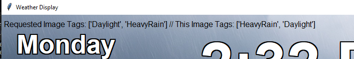

# ID.WeatherScreen
This is a Python-based weather screen. This screen is intended to run on a Raspberry Pi (tested on Pi 5, but could work on any machine).


This system uses multiple sources for data, and requires a bit of setup in order to get working. I'm working on the plug-and-play functionality with Raspberry Pi, but that will take some time.

## Raspberry Pi 5 Setup Instructions

### 1. Install Required Python Packages

Ensure your Raspberry Pi is running Python 3 and has `pip` installed. Then install the project dependencies:

```bash
cd /path/to/ID.WeatherStation
python3 -m venv venv
source venv/bin/activate
pip install -r requirements.txt
```

This will create a virtual environment and install all required packages into it.

### 2. (Optional) Hide the Taskbar for a Clean Display

To enable autohide on the taskbar and create a more polished, kiosk-style appearance:

```bash
sudo apt install lxappearance
```

Then:

1. Open the terminal.
2. Run `lxappearance` or manually edit the file at `~/.config/lxpanel/LXDE-pi/panels/panel`.
3. Set `autohide=1` in the appropriate section.
4. Reboot to apply the changes.

### 3. Install as a Systemd Service (Optional)

To launch the weather screen automatically at boot into a full-screen graphical session:

1. Create a systemd service file at `/etc/systemd/system/idweatherscreen.service`:

```ini
[Unit]
Description=Weather Dashboard Fullscreen
After=graphical-session.target
Wants=graphical-session.target

[Service]
ExecStart=/bin/bash -c 'sleep 10 && cd /path/to/source && source venv/bin/activate && export DISPLAY=:0 && python3 ID.WeatherScreen.py'
WorkingDirectory=/path/to/source
Environment="XDG_RUNTIME_DIR=/run/user/1000"
Restart=always
User=pi

[Install]
WantedBy=graphical.target
```

> ⚠ Replace `/path/to/source` with the full path to your cloned `ID.WeatherStation` directory.

2. Reload systemd and enable the service:

```bash
sudo systemctl daemon-reexec
sudo systemctl enable idweatherscreen.service
sudo systemctl start idweatherscreen.service
```

## Background Images & EXIF Classification

The `ID.WeatherStation` dashboard dynamically selects a background image that matches the current weather and time of day. To function properly, the following must be observed:

### 1. Required Folder and Formats

You must place at least one image (`.jpg`, `.jpeg`, or `.png`) into the following directory:

```
/assets/backgrounds
```

Due to licensing restrictions, no default backgrounds are included in this repository. You are responsible for supplying your own images.

### 2. Image Tagging for Weather-Based Selection

To allow the system to intelligently choose an image based on weather conditions, each image must be tagged with appropriate EXIF metadata, depending on the file type:

- JPEG/JPG: Tags are stored in the `Keywords` field.
- PNG: Tags are stored in the `Tags` field.

Each image must include:

- Time Tag (choose one):
  - `Daylight`, `Night`, `Sunrise`, `Sunset`
- Weather Tag (choose one):
  - `Clear`, `PartlyCloudy`, `Overcast`, `Foggy`, `Lightning`, `LightRain`, `MediumRain`, `HeavyRain`, `Snow`

If images are not properly tagged, they will not be considered for weather/time selection.

You may use tools like ExifTool to manually apply these tags.

### 3. Automatic Tagging with ChatGPT (Optional)

If you set up `CHATGPT_KEY` with a valid OpenAI API key, the system will automatically tag new images:

- Place your untagged images in:
  ```
  /assets/unprocessed
  ```
- The application will analyze each image using GPT, determine the appropriate tags, encode the EXIF metadata, and move the processed image to:
  ```
  /assets/backgrounds
  ```

This automated classification process is optional but highly recommended for large image sets.

### 4. Fallback Behavior

If no images match the current weather and time requirements, the dashboard will randomly select any image from `/assets/backgrounds`, regardless of its tags. This is the only scenario where improperly tagged images may be used.

### 5. Recommended Image Size

Images should ideally match the resolution of your display (for example, 1920x1080 for 1080p screens), but non-matching resolutions are still supported. Images will be resized to fill the screen when they are displayed.

# Settings and Configuration

## First Run

On the first run, the system will automatically generate a configuration file named:
```
weatherscreen.config
```

This file is saved in the same directory as the Python scripts. It contains all the necessary configuration for your weather display and can be edited to suit your needs. If the file does not exist, it will be created with default values.

**Please note:** When you first start the project, it will create the .config properly, but it will be initialized with blank values for API Keys and Location. You *must* fill in the following values in order for the system to operate:

- `Weather.Location`
- `Weather.WeatherAPI.Key`

Other values are optional, but recommended.

## Configuration Sections

The configuration file is divided into several sections, each with a specific purpose:

### `Logging`

Controls the logging and debug output.

- `EnableTrace`: Enables more verbose internal tracing.
- `EnableDebug`: Enables detailed debug output.
- `LoggingLevel`: One of `"INFO"`, `"DEBUG"`, etc. Sets the minimum logging level.

### `Services`

Contains API keys and data provider selections.

#### `WeatherAPI` / `WeatherUnderground`

- `Key`: Your API key for each service.

#### `Selections`

Specifies which service is used for each data type.

- `History`: Provider for historical weather data. (Possible Values: WeatherUnderground)
- `Forecast`: Provider for forecast data. (Possible Values: WeatherAPI)
- `Sun`: Provider for sunrise/sunset calculations. (Possible Values: SunriseSunset)
- `Current`: A prioritized list of providers for current weather data (e.g. `["WeatherAPI", "WeatherUnderground"]`). The first provider will provide the base data, and then subsequent providers will overlay their data.

### `ChatGPT`

Specifies ChatGPT integration for image tagging.

- `Key`: Your OpenAI API key.
- `Model`: Model to use (e.g., `"gpt-4o"`).

### `Weather`

Main settings related to display and measurement preferences.

- `Location`: Location. This can be a Zip Code, a City, State, or a Latitude,Longitude value.
- `StationCode`: Station code (e.g., Weather Underground personal weather station ID).
- `Temperature`: `"F"` for Fahrenheit or `"C"` for Celsius.
- `Pressure`: `"MB"` for millibars or `"HG"` for inches of mercury.
- `Wind`: `"MPH"` or `"KPH"`.
- `Visibility`: `"Miles"` or `"Kilometers"`.
- `Precipitation`: `"MM"` for millimeters or `"IN"` for inches.

These fields control how the system interprets and formats raw weather data.

### Weather Screen Element Options

These settings control the on-screen position and style of individual weather-related text elements. Each setting is an object with fields like:

These options apply to all display options:

- `X`, `Y`: Coordinates relative to the top-left of the screen (Tkinter coordinate system).
- `Enabled`: Whether the element is drawn on the canvas.

The following apply to each element type:

#### Icon
Icon items are for the Weather Icons. You can use either Icon or Emoji. Both serve the same purpose, except Icons are images that are located in the repo. In front of each Icons are stacked Emojis for additional issues that the Icons cannot cover.

- `Width`: Width (in px) for the icon
- `Height`: Height (in px) for the icon
- `Stroke`: If `True`, this will use the high-contrast icons with strokes around major objects that make it easier to see what the element is. Some of the Icons are hard to see, but they are designed to blend into the background to make it more nice to look at.

**Emoji Options:**
The following elements only apply to the Emojis that would be stacked on top of the Icon (if applicable). If there is no Emoji, it won't be displayed. Emoji Options will use the parent options unless they are set.

- `FillColor`: Hex or named color (e.g. `"#FFF"`, `"red"`).
- `FontFamily`: Optional font name. Overrides the font for the system.
- `FontWeight`: Can be `"normal"` or `"bold"`.
- `FontSize`: Size of the emoji in points.
- `Anchor`: Text anchor (`"center"`, `"e"`, `"ne"`, etc.) for the Emojis.
- `StrokeColor`: Sets the color of the outline around the object/text.
- `StrokeWidth`: Sets the size of the outline around the object/text
- `Justify`: What side of the bounding box should the text align (`left`, `center`, or `right`)

#### Text

- `FillColor`: Hex or named color (e.g. `"#FFF"`, `"red"`).
- `FontFamily`: Optional font name.
- `FontWeight`: Can be `"normal"` or `"bold"`.
- `FontSize`: Size of the text in points.
- `Anchor`: Text anchor (`"center"`, `"e"`, `"ne"`, etc.).
- `Stroke`: If `True`, applies a stroke outline around the object/text for better readability.
- `StrokeColor`: Sets the color of the outline around the object/text.
- `StrokeWidth`: Sets the size of the outline around the object/text
- `Justify`: What side of the bounding box should the text align (`left`, `center`, or `right`)

#### Formatted (inherits from Text)

- `Format`: For datetime Formatted Elements, this is how the text is formatted (see datetime.strftime for more info)

#### Square

- `Size`: The size (both X and Y) for that element.

#### Sized

- `Width`: The width (in pixels) how wide the element is.
- `Height`: The height (in pixels) on how tall an element is.

#### Nested Text Elements

If Text is nested inside of another setting, `X` and `Y` are the offsets from the natural position inside the element (for example, in Wind Indicator, the X/Y offset from the normal location where the speed indicators are.)

### Customizable Elements

Debug Elements:

- `ImageTags`: (Text) Debug display showing weather tags used vs. chosen background. (Default: Disabled) 
- `Uptime`: (Text) System runtime since application launch.

Bottom-Right Elements:


- `LastUpdated`: (Formatted) Displays the timestamp of the most recent data update.
- `Observed`: (Formatted) Time the weather data was observed.
- `Source`: (Text) The source that provided the current weather data.
- `Station`: Shows the name or ID of the reporting station.

Date Elements:


- `DayOfWeek`: (Text) The day of the week display.
- `FullDate`, `Time`: (Formatted) Show date and time components.

Temp Display Elements:


- `CurrentTempEmoji`: (Text) (DEFAULT: Disabled) Emoji icon for the current condition.
- `CurrentTempIcon`: (Text) Icon for the current condition
- `CurrentTemp`, `FeelsLike`, `TempHigh`, `TempLow`: Current and forecasted temperatures.

Individual Elements:


- `WindIndicator`: Circular widget showing wind speed, gust, direction, and and faded arrows for prior wind directions (`HistoryArrows` configurable).
- `HumiditySquare`: Displays current humidity in a visual square with emoji and percentage label.
- `RainSquare`: Shows current rain level visually, adjusting units based on precipitation setting.


- `RainForecast`: Bar-style graph for the next 24 hours of forecasted rain, including cloud cover, emoji, hourly rain amount, and a sunrise/sunset gradient.


- `TemperatureGraph`: A smoothed temperature graph showing historical temps over the last 24 hours, connecting missing data gaps and colorizing based on value.

> ⚠️ There is a known bug with the Observed WUnderground Temperature data. For some reason, it caches the History data improperly, and so when you query from Python, it is old data. I've let the WUnderground team know about this improper caching issue. Please note that the WUnderground History is only queried __once__ per startup to gather the last 24 hours of data. After that, the History Data is cached from calls to Current.

**NOTE:** Updating the weatherscreen.config will change the weatherscreen within 5 seconds (usually ~2 seconds).

Other Customizable elements will be added in the future.

